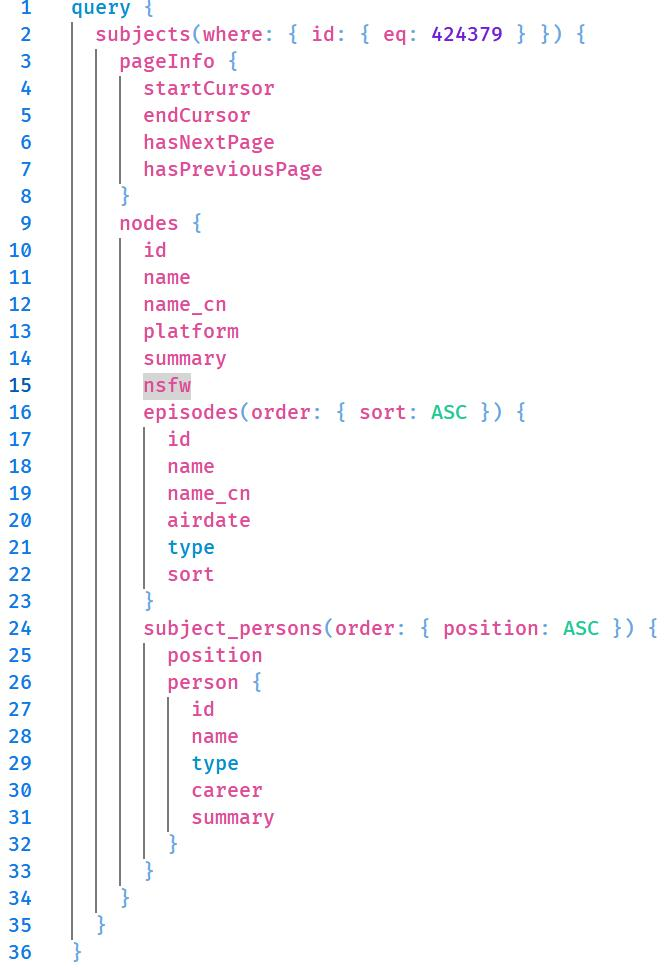
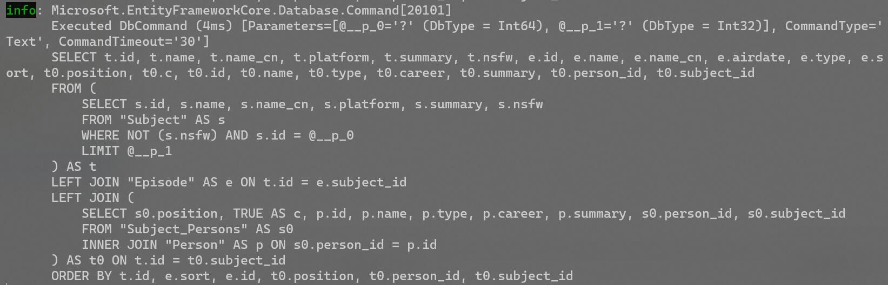
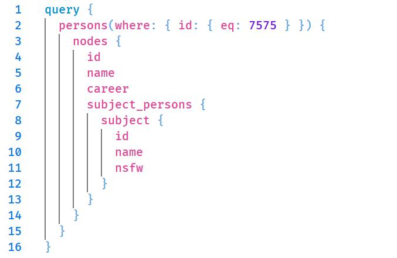
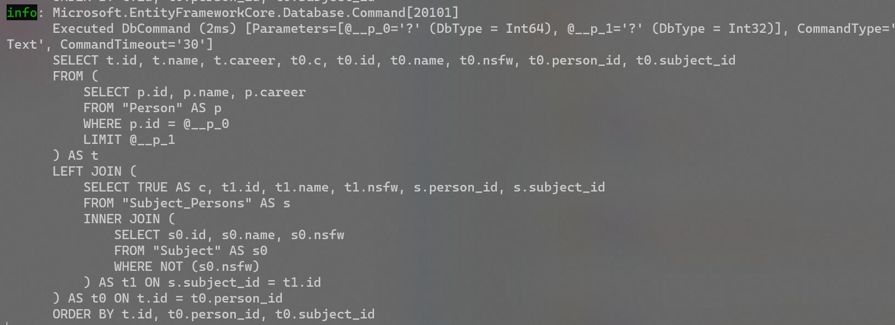
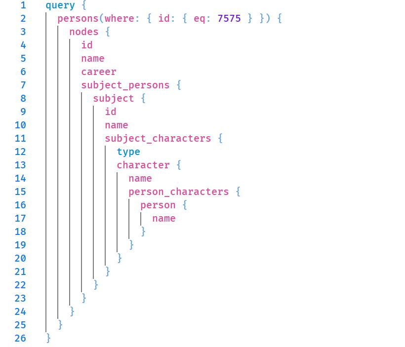
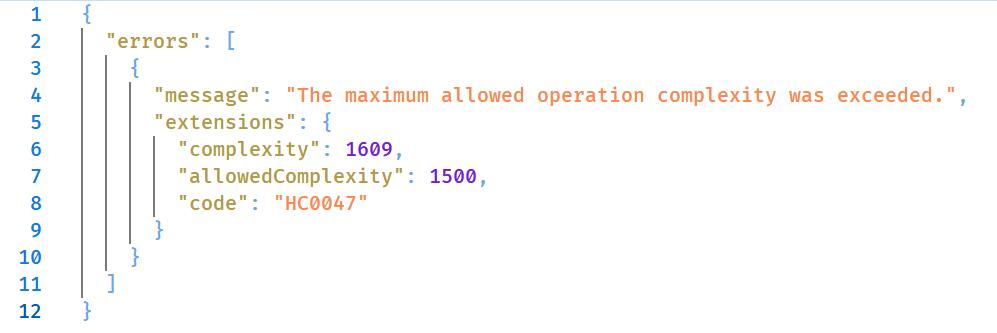
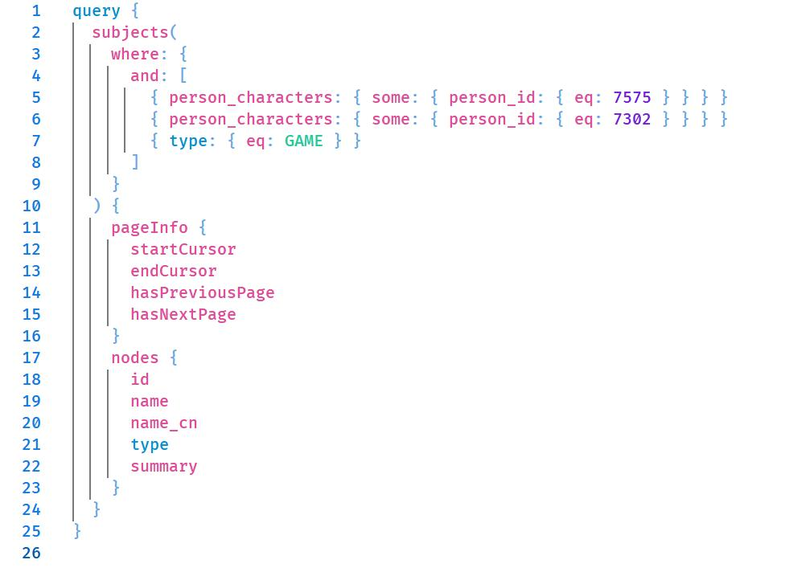
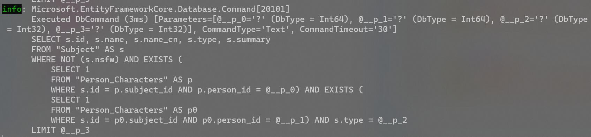

# bangumi-graph

[bangumi.tv](https://github.com/bangumi) GraphQL 原型，使用 C# 和 [Hot Chocolate](https://chillicream.com/docs/hotchocolate) 实现.

## Snapshots

GraphQL 直接翻译 SQL 查询：

全局过滤器：

复杂度限制：

查询协作作品：

